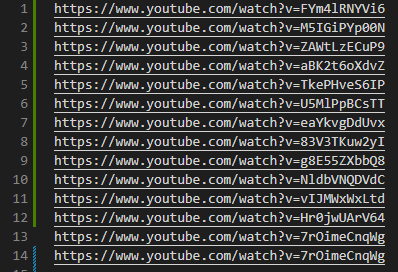

# YouTube-Catalogue

Le projet Youtube-Catalogue est un outil permettant de télécharger et de catégoriser des vidéos YouTube à des fins de recherche. 


# Pourquoi Youtube-Catalogue ?

Ce projet est un projet d'étudiants réalisé par des élèves de l'ESIEE Paris. Il a pour but d'être utilisé par des sociologues du CNR (Centre National de Recherche) 
afin de déceller de potentiels corrélations sur YouTube.

# Les fonctionnalités

## Télécharger des vidéos

Youtube-Catalogue permet de télécharger des vidéos YouTube à partir d'une URL ou d'un fichier CSV. 

#### Exemple de fichier CSV :


## Rechercher des vidéos dans le catalogue

La fonction de recherche permet de récupérer les vidéos téléchargées dans le catalogue en appliquant de multiples critères de sélection 

### Liste des critères:

- Mots clés
- Catégories propres à YouTube
- Likes Min/Max
- Nbr de vues Max/Min
- Durée de la vidéo Max/Min
- Date d'upload de la vidéo

## Labéliser des vidéos

Les vidéos téléchargés peuvent être labélisées afin de créer des sous-corpus de recherche. Cela s'effectue par l'ajout de Tags sur une ou plusieurs vidéos.
Il est ensuite possible de recherche ces Tags.

## Visualiser les statistiques des vidéos

La page de statistiques regroupe différents graphiques permettant de visualiser les stats des vidéos sélectionnées dans le corpus de recherche.

#### Exemple de statistiques :
[Image de statistiques de Youtube-Catalogue](public/images/stats.png)

# Installation

## 1°) Cloner le repository
```
git clone https://github.com/Vitrox77/YouTube-Catalogue.git
```
ou

télécharger le projet [ici](https://github.com/Vitrox77/YouTube-Catalogue/archive/refs/heads/main.zip
)
## 2°) Version de PHP
Avoir une version de PHP > 7 dans les variables d'environnement de la machine.

## 3°) Installer Composer
[Composer](https://getcomposer.org/download/)

## 4°) Installer NodeJS
[NodeJS](https://nodejs.org/en/download/)

## 5°) Installer Symfony CLI
[Symfony CLI](https://symfony.com/download)


## 6°) Initialiser le projet
Ouvrir un terminal dans le projet et éxécuter les commandes suivantes :
```
php bin/console doctrine:database:create
php bin/console doctrine:migrations:migrate
```

Ces commandes vont permettre de :

- Créer la base de données
- Créer les tables

Il est possible d'importer un fichier SQL pour remplir la base de données avec un petit jeux de données adéquat pour tester les fonctionnalités
en important le fichier [yt_catalogue.sql](public/files/yt_catalogue.sql) présent dans le projet.

## 7°) Lancer Youtube-Catalogue

Ouvrir un terminal à la racine du projet et éxécuter les commandes suivantes :
```
composer install 
symfony server:start
npm run build
```

# Architecture du projet

Le projet respecte le modèle MVC (Modèle, Vue, Controleur) de Symfony 

Dans le répertoire [src/](src), se trouve les répertoires :

- Controller (Les fichiers de gestion des routes qui transfèrent les données aux vues)
- Entity (Les classes d'objet correspondant aux tables de la base de données)
- Form (Tous les formulaires utilisés dans les vues)
- Repository (Fichiers gérant les requêtes d'interrogation de la base de données par rapport aux entities)
- Service (Fichiers contenant les fonctions pouvant être utilisées dans d'autres fichiers)

Les vues du projet se trouvent dans le dossier [templates/](templates)

Pour plus d'informations, la [documentation](symfony.com/doc/5.4/index.html) de symfony est a disposition.


## Contributeurs

- [Guillaume DAVY](https://github.com/GuillaumeDavy)
- [Alexandre JOUDIOUX](https://github.com/Vitrox77)
- [Matthias JOUEN](https://github.com/MatthiasJouen)
- [Diye NDIAYE](https://github.com/diye1210)
- [Laurine PILLET](https://github.com/Laur1502)
